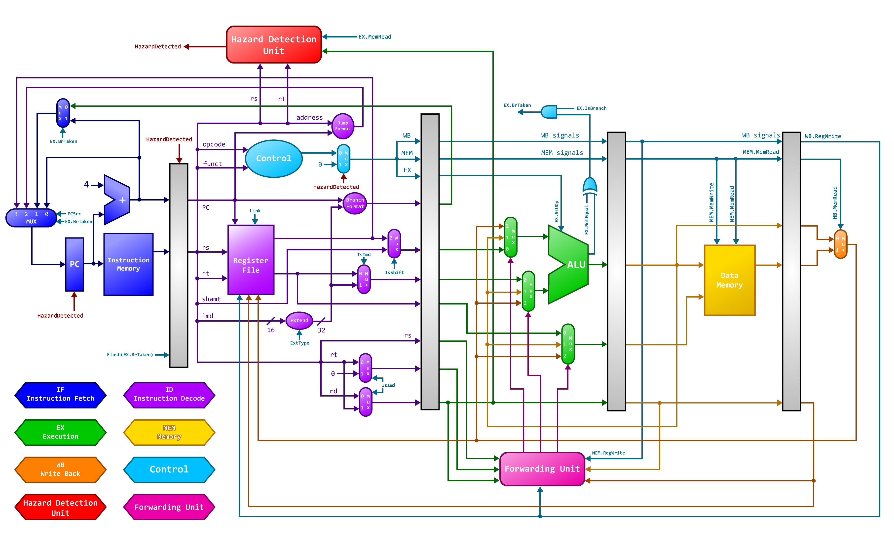

# MIPS com Pipeline
Implementação do MIPS com pipeline, em Verilog, para trabalho prático da disciplina de 
Organização de Computadores II, da Universidade Federal de Viçosa - Campus Florestal.

## Diagrama do Circuito

## Instruções do MIPS
Nesta implementação do caminho de dados do MIPS, feita com pipeline, é oferecido suporte a 18 instruções:
`add`, `addi`, `and`, `beq`, `bne`, `j`, `jal`, `jr`, `lui`, `lw`, `or`, `ori`, `sub`, `sll`, `slt`,
`sra`, `srl`, `sw`. 
Qualquer instrução presente num programa que não estiver entre essas possuem resultado totalmente imprevisto.

## Como utilizar
Para rodar qualquer programa neste caminho de dados, basta trocar o arquivo `program.txt` pelo programa que se pretende rodar. 
Ele deve estar em binário, com cada uma das linhas correspondendo a uma instrução, da mesma forma como é a saída do programa MARS Mips Simulator na opção "Binary Text".
Ex.: `00000001000100001000100000100000` fará executar a instrução `add $s1, $t0, $s0`.

Se desejar inicializar a memória de dados com valores, basta trocar o arquivo `data.txt` pelos dados que se pretende inserir. 
Cada linha corresponde a uma posição na memória e deve estar em hexadecimal, sem o prefixo `0x`, apenas os 8 dígitos hexadecimais.
Ex.: `FFFFFFC0` vai armazenar o valor `-64` na memória.

Além disso, a quantidade de ciclos de clock necessários para rodar um programa varia bastante devido aos jumps e branches, portanto, para garantir que o programa rode por completo, use alguma ferramenta para saber quantas instruções são executadas até que ele se complete (o MARS disponibiliza isso em Tools -> Instruction Counter) e, dentro o arquivo `sim.v`, altere o tempo de espera do comando `$finish` para o dobro da quantia contada, na linha 123.

## Memória
Nesta implementação, a memória de instruções está configurada para 1 MB, comportando 256 palavras/instruções e a memória de dados está configurada para 4 MB, comportando 1024 palavras/instruções.

Se for desejado expandir essa capacidade, é necessário realizar algumas alterações (lembrando que os dois bits menos significativos, no endereçamento por palavra, são sempre 00, pois o endereço é sempre múltiplo de 4):

- Instruções: para suportar `N` instruções, deve-se mudar a quantia da array de registradores para `[N - 1 : 0]`, e os bits do endereço que devem ser utilizados são `[log2(N) + 1 : 2]`. Ex.: Para 512 instruções, array de `[511:0]` e endereço `[10:2]` (`log2(512) + 1 = 9 + 1 = 10`).
- Dados: para armazenar `N` valores (de 32 bits), deve-se mudar a quantia da array de registradores para `[N - 1 : 0]`, e os bits do endereço que devem ser utilizados são `[log2(N) + 1 : 2]`. Além disso, dentro do arquivo do banco de registradores, na parte de inicialização, deve-se mudar o valor do stack pointer (registrador `$sp` ou `$29`), pois ele sempre aponta para o topo da pilha, que, no início de qualquer programa, é o último endereço da memória. Sendo assim, o novo valor de inicialização do stack pointer deve ser `(N - 1) * 4`. Ex.: Para 4096 valores, array de `[4095:0]` e endereço `[13:2]` (`log2(4096) + 1 = 12 + 1 = 13`), stack pointer deve ser iniciado em `32'h00003FFC`.
